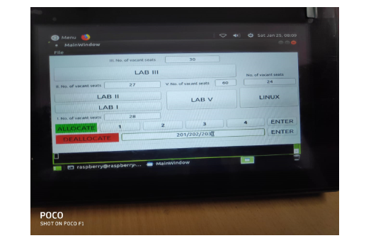

# DISA
Dynamic Seat Allocation System for CSC, IIT Delhi

## Proposal
The main need our project addresses is that of availability of seats in CSC during exam times. Often we decide to go to CSC in a group to study but on reaching we find that there are no seats available for all of us to sit together.
 
Our project tries to address this issue at a small scale, by assigning seats so that the maximum number of contiguous seats are available at all times. The problem is not trivial as one or more seats may fall empty as and when people leave, leading inevitably to fragmentation. We hope to devise an algorithm which addresses this. The problem is very similar to (almost homologous to) many packing problems - for instance, in crystallography, lattice mechanics, and resembles the file management / defragmentation issue on a hard disk (the need for ‘all parts of the same file to stay together in contiguous chunks’). We may extend it (a) into other areas of practical use as well such as auditorium seating during event, crown management, optimizing flat allocation during housing allotment etc (b) to allow prior booking of seats online with estimated time of usage (this will avoid the twin disappointments of (a) arriving and finding no seats available and (b) of wasting time).

## Prototype
The prototype that we have developed will be placed on the guard’s desk, and will be accessible to him for operating purposes.
This is how the system will look like-

Here, we show the step-by-step method that one has to follow to get the desired number of seats, and then the way to deallocate them once leaving:
According to preference, one is given a choice to select the lab depending on the location one is comfortable sitting in. Suppose, Lab 1 is clicked.

Then, one has to select the number of seats required in that particular lab. Suppose, we select 2.

Then, the ENTER tab in line with the Allocate button has to be pressed. The seats displayed in front of Lab 1 will change to 28 in this case. Seat has been allocated now.

To deallocate the seats, the guard will enter the seat numbers told by students in Deallocate Seat Input Tab. Suppose, one enters 201, 202, 203 (with any delimiter for eg - ‘ ’, /, ‘,’, etc.). It’s understood that by 201, one refers to Lab 2 and Seat No 1. 

After pressing Enter, the seats (here, 201, 202, 203) will be deallocated. In our case, no of vacant seats for Lab 2 changed to 30 from 27, once they were freed.

## End Product
User interface will display lab numbers along with the vacant seats in each lab. Other buttons for allocation and deallocation of seats will also be there.

At first, students can choose the lab (as the number of vacant seats are displayed, students can choose accordingly)by clicking on it.

Next step is to select the number of seats required by the group. Students have to simply click on the allocate option on the same window, then select the number of seats (1/2/3/4), press Enter.
After completing the above procedure students will be provided with the printed slips containing the seat no.
An option of deallocation is also provided on the screen, this is basically to deallocate the PC once the user leaves it. User has to enter the seat numbers to be deallocated, and press Enter. The corresponding seat will be made available for the next user.

We worked on the efficiency of the algorithm by taking care to allot seats in a linear manner. By providing the count of available seats in each lab we ensured that less  time is invested by the student to get the seat allocated. Thus we developed the algorithm, implemented it as a stand-alone system .
